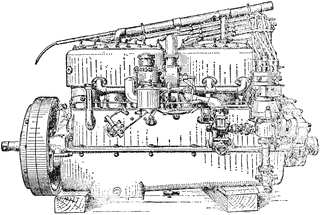

# NINAGE ENGINE
> **N**inage **I**s **N**ot **A** **G**ame **E**ngine

> 

> (But it can be used as a game engine)

> It's purpose is to be an interactive media engine, games just happen
> to fall into that catagory.

## Documentation
> [Documentation](DOCUMENTATION.md)

## Getting Started
* Make sure you have the [requirements](REQUIREMENTS.md).
> Run the following commands:

        git submodule init
        git submodule update
        git submodule sync

> This will setup the project and make sure you have everything.

## Development
> To make it easier to work on the core engine / lib, you can run
> the `develop.sh` script.

        ./develop.sh

> The `develop.sh` script will do the following:
* Compile and install the `core engine`
* Compile and launch the `testgame`

> You may use the `testgame` to test changes made in the `core engine`.
> It does not matter if you push changes made in the `testgame` since it
> was created for testing purposes.

## Manual Development
### Compiling and installing the engine:

        cd libninage
        sudo make install

> This will install the engine into your system / computer.

### Compiling the testgame
> To compile the testgame, make sure you have installed the engine first,
> following the steps above.

> Run these commands to compile and start the testgame:

        cd testgame
        make
        ./game.out

> The game should be up and running.
