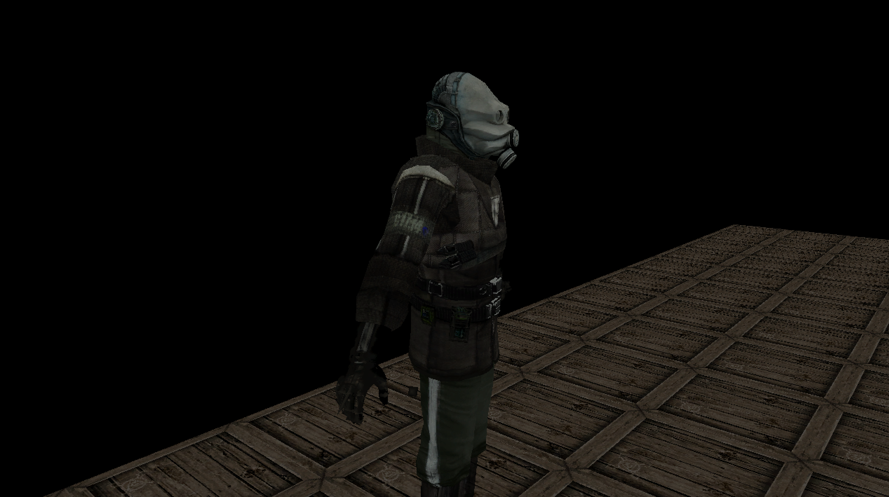
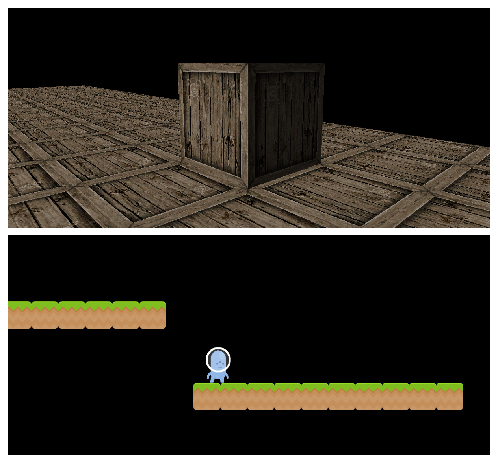

# NINAGE ENGINE
> **N**inage **I**s **N**ot **A** **G**ame **E**ngine

> 
> 

> (But it can be used as a game engine)

> It's purpose is to be an interactive media engine, games just happen
> to fall into that category.

## Supported Dimensions
* 2D
* 3D

## Documentation
> [Documentation](DOCUMENTATION.md)
> [Full Documentation][https://sebbekarlsson.github.io/NINAGE-Engine/]

## Getting Started
* Make sure you have the [requirements](REQUIREMENTS.md).
> Run the following commands:

        git submodule init
        git submodule update
        git submodule sync

> This will setup the project and make sure you have everything.

## Development
> To make it easier to work on the core engine / lib, you can run
> the `develop.sh` script.

        ./develop.sh <directory-name-in-`NINAGE-examples`>

> The `develop.sh` script will do the following:
* Compile and install the `core engine`
* Compile and launch a specified example.

## Manual Development
### Compiling and installing the engine:

        cd libninage
        sudo make install

> This will install the engine into your system / computer.

### Compiling an example
> To compile an example, make sure you have installed the engine first,
> following the steps above.

> Run these commands to compile and start the testgame:

        cd NINAGE-examples/<example-dir>
        make
        ./app.out

> The app should be up and running.

### Having problems with libjpeg?

        wget -c http://www.ijg.org/files/jpegsrc.v8d.tar.gz
        tar xzf jpegsrc.v8d.tar.gz
        cd jpeg-8d
        ./configure
        make
        cp ./.libs/libjpeg.8.dylib /usr/local/opt/jpeg/lib

## License
> [GNU General Public License](LICENSE.md)
